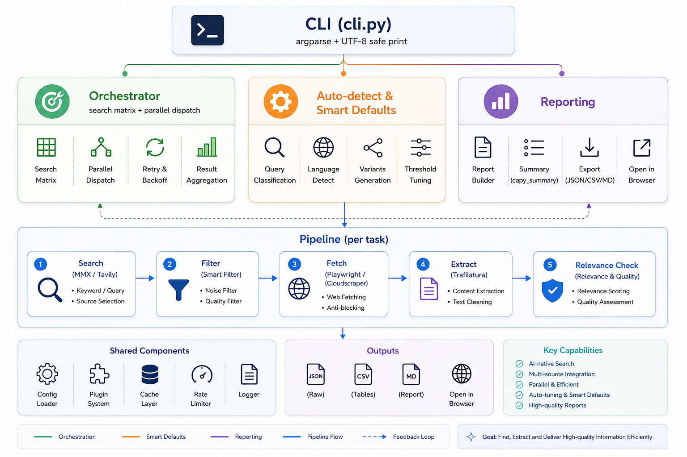

# deep-dive

> 面向 Agent 的深度研究引擎：多角度并行检索 + 多语种扩展 + 站点定向 + 全文抓取 + 去重聚合 + 结构化 Markdown 报告输出。

[](LICENSE)
[](https://www.python.org/downloads/)
[](https://github.com/Suanmd/deep-dive/releases)
[](tests/)
[](https://github.com/astral-sh/ruff)

---

## 🏗️ 架构



详见 [docs/architecture.md](docs/architecture.md)。

## ✨ 核心特性

- **多角度搜索矩阵** — 5 种查询模板（人文 / 技术 / 学术 / 新闻 / 商业）× 3 档深度（quick / normal / full）× **6 种视角变体**（original / refined / critique / academic / primary / comparative）
- **双引擎策略** — MMX（主，需安装 mmx CLI）+ Tavily（兜底，**N-key 依次自动 fallback**：任意个 key 池化按序轮换，quota/auth/network/timeout 任意一种就切下一个）
- **Plan 驱动模式** — 宿主 LLM 提供 `ResearchPlan` JSON，编排器直接消费 `variants` / `english_search_terms` / `target_sites`
- **站点定向** — `target_sites` 发出 `site:<domain>` 查询，走 Tavily 通道（原生支持 `site:` 操作符）
- **全栈抓取** — Playwright（Chromium headless）主 + CloudScraper（CF 高防）兜底；支持 cookie 注入、随机 UA、人类行为模拟
- **Cookie 注入** — 可选 `config/cookies.json`（gitignored）支持登录墙站点；模板在 `config/cookies.example.json`
- **URL 过滤** — canonical 化、tracking 参数剥离、黑名单域名、低质 host 模式、每域名 cap
- **两阶段相关性检查** — 单字密度 + 核心实体命中率；准确拦截离题内容
- **跨任务去重** — URL 去重 + 段落 SHA1 去重；dedup=0 时自动 rescue 拼救 raw
- **结构化 Markdown 报告** — 4 段式（任务执行 / URL 来源 / 全文内容 / 元数据）+ 自动 Capy 摘要（主题聚类 + 关键引用 + 多空论据）
- **配置与代码分离** — 全部可调值在 `config/defaults.yaml`，代码里没有硬编码
- **v1.0.0 质量门控** — info-density 评分替代纯字数阈值；音乐/媒体域名豁免（music.apple.com / kuwo.cn / 网易云 / Spotify 等 16 个平台）；PDF / DOC 二进制 URL 跳过
- **Capy 段落级论点抽取** — 质量评分（length + data density + source authority）+ 来源归属 + 多义词 corpus 主题聚类（5 主题桶）
- **Pipeline fetch 并发** — `asyncio.gather + Semaphore(3)` 取代串行，单 task 内 N 个 fetch 从 N×page_timeout 降到 ~N/3×page_timeout
- **CI 全覆盖** — ruff / mypy / bandit / pip-audit / pytest 在 `.github/workflows/ci.yml` 跑同一套

## 🚀 快速开始

### 安装

```bash
# 克隆
git clone https://github.com/Suanmd/deep-dive.git
cd deep-dive

# 装运行时依赖
pip install -r requirements.txt

# 装 Playwright Chromium
playwright install chromium

# 装包（让 `deep-dive` 命令可用）
pip install -e .
```

### 配置 API Key

`deep-dive` 优先从环境变量读 Tavily 凭证：

```bash
# 主 key
export TAVILY_API_KEY="***"

# 推荐：N-key 池
export TAVILY_API_KEYS="tvly-key1,tvly-key2,tvly-key3"
```

> MMX CLI 是外部依赖（不打包）。要 MMX 做主引擎就单独装；否则只用 Tavily。详见 [docs/installation.md](docs/installation.md)。

### 最简调用

```bash
# 作为 Python 模块
python -m deep_dive --query "<你的研究主题>" --depth normal --lang auto

# 作为 console script（装包后）
deep-dive --query "<你的研究主题>" --depth normal
```

输出落在 `./tmp/deep-dive/<topic>__<run-id>/`。

### Plan 模式（可选）

宿主 LLM 可生成 `ResearchPlan` JSON 喂给 `deep-dive`，让搜索策略更精细：

```bash
deep-dive --plan my_research_plan.json --query "<topic>"
```

Plan schema 见 [docs/usage.md](docs/usage.md)。`--query` 仍必填（plan 里的 query 字段冗余保险）。

## 📊 输出结构

```
tmp/deep-dive/
└── <topic-slug>__<run-id>/
    ├── report.md              # 主报告（4 段式 + Capy 摘要）
    ├── summary.json           # 元数据（task_results + aggregated 统计）
    ├── <topic>_raw_all.txt    # auto-rescue 拼救的全文（dedup=0 时才有）
    ├── raw/                   # 每个 task 的原始输出
    │   ├── task_00/
    │   │   ├── metadata.json
    │   │   ├── url_mapping.json
    │   │   └── *.html / *.txt
    │   └── ...
    └── debug/                 # 仅在 --debug 时写
        ├── heartbeat.log
        └── matrix.json
```

## ⚙️ CLI 选项

| Flag | 默认 | 说明 |
|------|------|------|
| `--query` | 必填 | 搜索主题 |
| `--depth` | `normal` | `quick` / `normal` / `full` |
| `--freshness` | 无 | `day` / `week` / `month` / `year` |
| `--lang` | `auto` | `auto` / `zh` / `en` |
| `--search-engine` | `auto` | `auto` / `mmx` / `tavily` |
| `--no-tavily` | `false` | 强制只走 MMX（不走 Tavily 兜底）|
| `--output` | `./tmp/deep-dive` | 输出根目录 |
| `--max-workers` | `2` | 并发任务数 |
| `--min-chars` | `1500` | 低质页字数阈值（info_density 评分兜底）|
| `--no-report` | `false` | 跳过 Markdown 报告生成 |
| `--no-capy` | `false` | 跳过 Capy 摘要 section |
| `--debug` | `false` | 落盘每步状态到 `<topic_dir>/debug/` |
| `--run-id` | 自动时间戳 | 自定义 run id（ASCII slug 强制）|
| `--plan PATH` | 无 | 加载 `ResearchPlan` JSON（可选 override）|
| `--print-config` | `false` | 打印 resolved configuration 为 JSON 并退出 |

## 🧠 SKILLS 智能默认（不传 plan 也能用）

`deep-dive` 设计原则：**用户只传 `query` 就应该 work**。

- `kind`（人文/技术/学术/新闻/商业/通用）— 按 query 关键词自动判断
- `language_priority`（zh-only/en-only/zh-primary/balanced）— 按 query 字符检测
- `variants`（6 种视角查询变体）— 自动用 query + 语种后缀生成
- `english_search_terms`（英文检索词）— 默认用原 query
- `target_sites`（site: 定向列表）— **默认空**，搜索引擎全网找，不硬塞路径
- `relevance_threshold`（相关性阈值）— 默认 0.30

要精细控制，--plan 仍可用，但**完全可选**。

## 🧪 测试

```bash
# 跑全部测试
pytest

# 单元测试（无网络）
pytest tests/unit

# 带覆盖率
pytest --cov=deep_dive --cov-report=term-missing

# 类型检查
mypy src/deep_dive

# Lint + format
ruff check src tests
ruff format --check src tests
```

## ⚙️ 配置

用户可调值在**配置文件**，不在代码里：

| 文件 | 用途 |
|------|------|
| `config/defaults.yaml` | 引擎、超时、深度档、质量阈值、低质域名列表 |
| `config/cookies.example.json` | 模板；复制到 `config/cookies.json`（gitignored）给登录墙站点 |
| `examples/*.sh` | 跑得快 / 标准 / 全深度的 demo 脚本 |

要改默认值，复制到 `~/.deep-dive/config.yaml` 或对应位置编辑。

## 🤝 贡献

欢迎 PR！详见 [CONTRIBUTING.md](CONTRIBUTING.md)。Bug 报告和功能请求走 [issue tracker](https://github.com/Suanmd/deep-dive/issues)。

## 🔐 安全

**绝不要** commit `config/cookies.json` 或真实 API key。文件已 gitignore；模板在 `config/cookies.example.json`。详见 [SECURITY.md](SECURITY.md) 报告漏洞和最佳实践。

## 📜 协议

[MIT License](LICENSE) — 详见文件。
